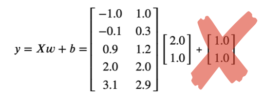
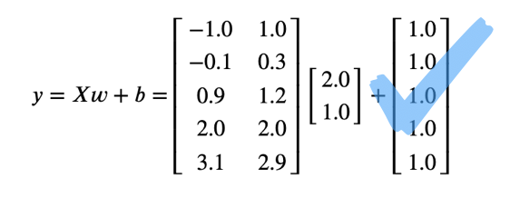

# 딥러닝을 위한 최적화와 수치해석

<table>
<tr>
    <td></td>
    <td>아래 목차의 링크를 이용하며 쉽게 소스코드를 볼 수 있습니다. 
      <br>책에서 사용된 모든 이미지는 images폴더에 있습니다.
      <br>궁금한 점은 Issue를 통해 문의하시면 최대한 빠른 시일에 답변해드립니다.
      <br>혹시 있을 코드 오류나 오탈자 등도 Issue를 통해 알려주시면 수정하여 반영하겠습니다.
  </td>
</tr>
</table>

## 개발환경 설정하기
### `yml`을 통해 불러오기
```bash
$ git clone https://github.com/DNRY/dlopt.git
$ cd dlopt
$ conda remove --name deep-learning --all
$ conda env create -f notebooks/env.yml
$ conda activate deep-learning

```

### `yml`없이 직접 설정하기
```bash
$ conda create --name deep-learning python=3.5
$ conda activate deep-learning
(deep-learning) $ conda install numpy=1.14.5 tensorflow=1.10 matplotlib=2 jupyter_client=5.3.1 jupyter notebook seaborn scikit-learn setuptools=39.1.0 cython
```

## 노트북 실행하기

```bash
$ git clone https://github.com/DNRY/dlopt.git
$ cd dlopt
$ conda activate deep-learning
(deep-learning)$ cd notebooks
(deep-learning)$ jupyter notebook

```

## 목차
1. 개발환경 설정하기
1. [주피터 노트북과 파이썬 튜토리얼](https://github.com/DNRY/dlopt/blob/master/notebooks/CH02.ipynb)
1. [텐서플로 튜토리얼](https://github.com/DNRY/dlopt/blob/master/notebooks/CH03.ipynb)
1. [최적화 이론에 필요한 선형대수와 미분](https://github.com/DNRY/dlopt/blob/master/notebooks/CH04.ipynb)
1. [딥러닝에 필요한 최적화 이론](https://github.com/DNRY/dlopt/blob/master/notebooks/CH05.ipynb)
1. [고전 수치최적화 알고리즘](https://github.com/DNRY/dlopt/blob/master/notebooks/CH06.ipynb)
1. [딥러닝을 위한 수치최적화 알고리즘](https://github.com/DNRY/dlopt/blob/master/notebooks/CH07.ipynb)
1. [선형회귀 모델](https://github.com/DNRY/dlopt/blob/master/notebooks/CH08.ipynb)
1. [선형 분류 모델](https://github.com/DNRY/dlopt/blob/master/notebooks/CH09.ipynb)
1. [신경망 회귀 모델](https://github.com/DNRY/dlopt/blob/master/notebooks/CH10.ipynb)
1. [신경망 분류 모델](https://github.com/DNRY/dlopt/blob/master/notebooks/CH11.ipynb)
1. [언더피팅/오버피팅 소개](https://github.com/DNRY/dlopt/blob/master/notebooks/CH12.ipynb)
1. [언더피팅의 진단과 해결책](https://github.com/DNRY/dlopt/blob/master/notebooks/CH13.ipynb)
1. [오버피팅의 진단과 해결책](https://github.com/DNRY/dlopt/blob/master/notebooks/CH14.ipynb)
1. [텐서보드(TensorBoard) 활용](https://github.com/DNRY/dlopt/blob/master/notebooks/CH15.ipynb)
1. [모델 저장하기와 불러오기](https://github.com/DNRY/dlopt/blob/master/notebooks/CH16.ipynb)
1. 딥러닝 가이드라인
1. [CNN 모델](https://github.com/DNRY/dlopt/blob/master/notebooks/CH18.ipynb)
1. [GAN(Generative Adversarial Networks) 모델](https://github.com/DNRY/dlopt/blob/master/notebooks/CH19.ipynb)
1. [영상](https://github.com/DNRY/dlopt/blob/master/notebooks/CH20.ipynb)
1. [문자열 분석 word2vec](https://github.com/DNRY/dlopt/blob/master/notebooks/CH21.ipynb)


## 수정사항
### 1. 51 Page `2.3.1 데이터 타입마다 다른 for loop 스타일`
- 변경 전:
    ```
    #출력:
    1 2
    3 4
    5 6
    1 2
    3 4
    5 6
    ```
- 변경 후:
    ```
    #출력:
    1 2
    3 4
    5 6
    ```
### 2. 137 Page 수식 오탈자
- 변경 전:



- 변경 후:


